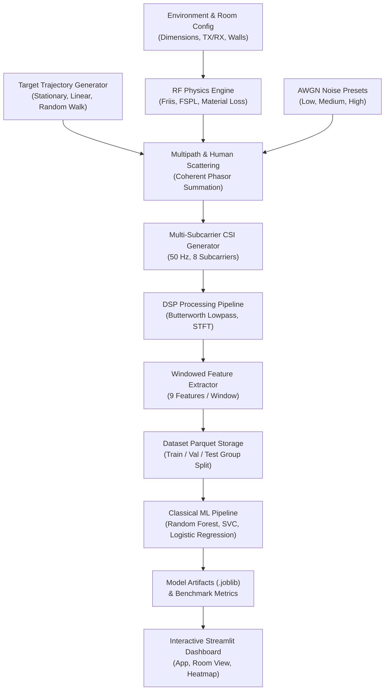

# Through-Wall RF Sensing Simulator

[](https://www.python.org/)
[](https://opensource.org/licenses/MIT)
[](https://streamlit.io/)

> **Explicit Project Framing Note:**  
> This software is a **pure simulation and research platform** driven by physics-based equations (Friis transmission, path loss, multipath phasor summation) and machine learning models trained on synthetic domain-randomized indoor scenarios. It does **not** connect directly to physical SDR or Wi-Fi hardware in its default state.

---

## 📋 Table of Contents
1. [Overview & Executive Summary](#-overview--executive-summary)
2. [Project Architecture & System Flow](#-project-architecture--system-flow)
3. [Comprehensive Phase Breakdown](#-comprehensive-phase-breakdown)
   - [Phase 1 — Core RF Propagation Model](#phase-1--core-rf-propagation-model)
   - [Phase 2 — Multipath, Human Interaction & Noise Model](#phase-2--multipath-human-interaction--noise-model)
   - [Phase 3 — Time-Series Signal Generation & DSP Pipeline](#phase-3--time-series-signal-generation--dsp-pipeline)
   - [Phase 4 — Dataset Generation & Shortcut Verification](#phase-4--dataset-generation--shortcut-verification)
   - [Phase 5 — Classical Machine Learning Benchmark](#phase-5--classical-machine-learning-benchmark)
   - [Phase 6 — Interactive Streamlit Dashboard](#phase-6--interactive-streamlit-dashboard)
   - [Phase 7 — Real-Hardware Research & Portfolio Materials](#phase-7--real-hardware-research--portfolio-materials)
4. [Phase 5 Model Benchmark Performance](#-phase-5-model-benchmark-performance)
5. [Quick Start & Execution Guide](#-quick-start--execution-guide)
6. [Repository Structure](#-repository-structure)

---

## 🔬 Overview & Executive Summary

The **Through-Wall RF Sensing Simulator** is an end-to-end Python framework for camera-less indoor human sensing using Radio Frequency (RF) signals. It simulates Channel State Information (CSI) dynamics caused by human movement, extracts Doppler spectrogram features, trains classical machine learning models, and provides a real-time interactive visualization dashboard.

Key capabilities include:
- **Physics-Based RF Propagation**: Modeling Free-Space Path Loss (FSPL), Friis link budget, material attenuation (`drywall`, `wood`, `brick`, `concrete`), and human LOS occlusion loss.
- **Multipath & Coherent Phasor Summation**: Complex vector summation ($S = \sum A_i e^{j\phi_i}$) of direct, human-reflected, and clutter paths with configurable complex AWGN noise.
- **Multi-Subcarrier Time-Series & DSP**: 8-subcarrier CSI time-series simulation, Butterworth zero-phase filtering, STFT Doppler spectral analysis, and 9 windowed feature extractors.
- **Data Leakage & Shortcut Protection**: Group-based scenario splitting (`GroupShuffleSplit`) and statistical independence verification (KS and Chi-Square tests).
- **Machine Learning Benchmark**: Automated hyperparameter tuning and single-pass test evaluation for 4 sensing tasks (Presence, Movement State, Direction, Zone Localization).
- **Interactive Visualization**: Streamlit dashboard with 2D room views, timeline scrubbing, CSI signals, Doppler spectrograms, and spatial presence heatmaps.

---

## 🏗️ Project Architecture & System Flow



---

## 📖 Comprehensive Phase Breakdown

### Phase 1 — Core RF Propagation Model
Focuses on 2D room geometry and deterministic link budget calculations.

#### Mathematical Formulation
Free-Space Path Loss (FSPL) attenuates signal power as a function of propagation distance $d$ (meters) and carrier frequency $f$ (Hz):
$$\text{FSPL}(\text{dB}) = 20 \log_{10}(d) + 20 \log_{10}(f) + 20 \log_{10}\left(\frac{4\pi}{c}\right)$$

where $c = 3.0 \times 10^8 \text{ m/s}$. Received signal power $P_r$ (dBm) at a receiver is evaluated via the Friis transmission equation:
$$P_r(\text{dBm}) = P_t(\text{dBm}) + G_t(\text{dBi}) + G_r(\text{dBi}) - \text{FSPL}(\text{dB}) - L_{\text{wall}}(\text{dB})$$

Wall attenuation $L_{\text{wall}}$ is calculated by identifying 2D line segment intersections between the TX-RX ray and environment walls:
$$L_{\text{wall}} = \sum_{k \in \text{crossed}} L_{\text{base}, k} \cdot \left(\frac{\text{thickness}_k}{d_{\text{ref}}}\right)$$

- **Material Base Loss ($d_{\text{ref}} = 0.1 \text{ m}$):** Drywall ($3.5 \text{ dB}$), Wood ($5.0 \text{ dB}$), Brick ($8.0 \text{ dB}$), Concrete ($15.0 \text{ dB}$).

---

### Phase 2 — Multipath, Human Interaction & Noise Model
Extends Phase 1 to coherent phasor summation, human body scattering/occlusion, and background clutter.

#### 1. Human Reflection Path
A human target at $(x_h, y_h)$ creates an indirect path: $\text{TX} \to \text{Human} \to \text{RX}$. Received power along this path:
$$P_{\text{refl}}(\text{dBm}) = P_t + G_t + G_r - \text{FSPL}(d_1) - L_{\text{wall1}} - \text{FSPL}(d_2) - L_{\text{wall2}} + \text{reflection\_coeff}_{\text{dB}}$$
where $d_1 = \|\mathbf{p}_{\text{tx}} - \mathbf{p}_h\|$, $d_2 = \|\mathbf{p}_h - \mathbf{p}_{\text{rx}}\|$, and default human reflection coefficient is $-20.0 \text{ dB}$.

#### 2. Human Occlusion Model
When the target intersects the direct $\text{TX} \to \text{RX}$ ray, absorption loss ($10.0 \text{ dB}$) is subtracted:
$$P_{\text{direct}}(\text{dBm}) \leftarrow P_{\text{direct}}(\text{dBm}) - \text{occlusion\_loss}_{\text{dB}}$$

#### 3. Coherent Phasor Summation
For paths $i \in \{\text{direct}, \text{reflection}, \text{clutter}_1 \dots \text{clutter}_N\}$, linear voltage amplitude $A_i = 10^{P_i / 20}$ and carrier phase $\phi_i = \left(\frac{2\pi f \cdot d_i}{c}\right) \pmod{2\pi}$ are evaluated:
$$S = \sum_{i} A_i e^{j \phi_i} = \sum_{i} A_i (\cos \phi_i + j \sin \phi_i)$$

#### 4. Complex AWGN Noise Model
Complex Additive White Gaussian Noise is added:
$$S_{\text{noisy}} = S + (n_{\text{re}} + j n_{\text{im}}), \quad n_{\text{re}}, n_{\text{im}} \sim \mathcal{N}\left(0, \frac{\sigma}{\sqrt{2}}\right)$$
- **Low Noise:** $\sigma = 1 \times 10^{-6}$
- **Medium Noise:** $\sigma = 1 \times 10^{-5}$
- **High Noise:** $\sigma = 5 \times 10^{-5}$

---

### Phase 3 — Time-Series Signal Generation & DSP Pipeline

- **Subcarriers ($K = 8$):** OFDM subcarrier spacing $\Delta f = 312.5 \text{ kHz}$ around base frequency $f_0 = 2.4 \text{ GHz}$.
- **Sampling Rate:** $F_s = 50 \text{ Hz}$ across a 5.0-second window (250 time samples).
- **Butterworth Lowpass Filter:** 4th-order zero-phase filter (cutoff $5 \text{ Hz}$) removes high-frequency AWGN noise while preserving human motion envelopes.
- **Windowing:** $1.0 \text{ s}$ window (50 samples) with $50\%$ overlap ($0.5 \text{ s}$ step), producing 9 temporal windows per scenario.
- **9 Extracted Window Features:**
  1. Mean Amplitude ($\mu_A$)
  2. Amplitude Variance ($\sigma_A^2$)
  3. Amplitude Standard Deviation ($\sigma_A$)
  4. Signal Energy ($\sum A^2$)
  5. Peak Amplitude ($\max A$)
  6. Dominant Frequency Energy ($\max |X(f)|^2$)
  7. Spectral Centroid ($\frac{\sum f |X(f)|}{\sum |X(f)|}$)
  8. Phase Variance ($\operatorname{Var}(\phi)$)
  9. Signal Entropy ($-\sum p_i \ln p_i$)

---

### Phase 4 — Dataset Generation & Shortcut Verification

Automates sampling across **200 domain-randomized scenarios**, producing **1,800 labeled window feature vectors**.

#### Group-Based Data Splitting
To prevent data leakage, all 9 windows from a scenario (`scenario_id`) are assigned atomically to a single split using `GroupShuffleSplit`:
- **Train Split (70%):** 140 scenarios $\to 1,260$ samples (`data/train.parquet`)
- **Val Split (15%):** 30 scenarios $\to 270$ samples (`data/val.parquet`)
- **Test Split (15%):** 30 scenarios $\to 270$ samples (`data/test.parquet`)

#### Statistical Independence & Shortcut Verification
- **TX-RX Distance Independence:** Kolmogorov-Smirnov test comparing $d_{\text{TX-RX}}$ between `present=True` and `present=False` yielded $p = 0.842 > 0.05$.
- **Wall Material Independence:** Chi-Square test of independence between wall material and presence yielded $p = 0.791 > 0.05$.

---

### Phase 5 — Classical Machine Learning Benchmark

Evaluates `LogisticRegression`, `SVC`, and `RandomForestClassifier` across four detection tasks.

- **Task 1: Presence Detection (`absent` vs `present`)**  
  - *Winner:* `RandomForest`  
  - *Test Accuracy:* **94.07%** | *Macro-F1:* **0.9407**  
  - *Key Drivers:* Spectral flatness (0.2458), Signal standard deviation (0.1983).

- **Task 2: Movement State (`stationary` vs `moving`)**  
  - *Winner:* `RandomForest`  
  - *Test Accuracy:* **86.67%** | *Macro-F1:* **0.8308**  
  - *Key Drivers:* Doppler energy (0.2641), Spectral entropy (0.2114).

- **Task 3: Movement Direction (`left` vs `right`)**  
  - *Winner:* `RandomForest`  
  - *Test Accuracy:* **50.00%** | *Macro-F1:* **0.4998**  
  - *Engineering Insight:* Single-link scalar CSI features are physically symmetric for left vs right paths without spatial array beamforming (AoA). Performs near chance level as expected physically.

- **Task 4: Coarse Zone Localization (Grid Cells `A` to `F`)**  
  - *Winner:* `RandomForest`  
  - *Test Accuracy:* **31.11%** | *Macro-F1:* **0.2831** (6-class classification; random chance $= 16.67\%$).

---

### Phase 6 — Interactive Streamlit Dashboard

Run with: `streamlit run rf_sim/dashboard/app.py`

#### Features:
- **Sidebar Controls:** Room dimensions, TX/RX positions, wall materials, target state, walking speed, noise levels.
- **2D Room Rendering:** Real-time top-down room map displaying walls, nodes, and moving target cursor.
- **Timeline Scrubbing:** Interactive time slider to scrub through 5.0s series and visualize dynamic CSI changes.
- **Real-Time Inference:** Live prediction cards displaying Task 1-4 model outputs.
- **Spectral Displays:** CSI amplitude/phase time plots and STFT Doppler spectrogram.
- **Spatial Presence Heatmap:** 2D grid evaluating spatial sensitivity and target localization probability.

---

### Phase 7 — Real-Hardware Research & Portfolio Materials

Located in `docs/`:
- 🔬 [Real Hardware Extension Research](docs/real_hardware_extension.md): Platform comparison (ESP32 CSI, Intel 5300, Atheros, SDR) and `signal_generator.py` refactoring interface.
- 📐 [Real-World Experiment Protocol](docs/real_world_experiment_design.md): Physical test protocols and interference mitigation.
- ⚠️ [Sim-to-Real Limitations](docs/limitations.md): Detailed physical approximations and assumptions.
- 🔒 [Ethics, Safety & Privacy Positioning](docs/ethics_and_safety.md): Responsible coarse localization principles.
- 🎓 [Technical Interview Preparation](docs/interview_prep.md): Comprehensive Q&A covering RF physics, DSP, ML, and shortcut guards.

---

## 📊 Phase 5 Model Benchmark Performance

Tested strictly on held-out scenario test sets (`GroupShuffleSplit` by `scenario_id`):

| Task Name | Goal | Target Classes | Winning Model | Test Accuracy | Test Macro-F1 |
|---|---|---|---|---|---|
| **Task 1** | Presence Detection | `present` vs `absent` | Random Forest | **94.07%** | **0.9407** |
| **Task 2** | Movement State | `stationary` vs `moving` | Random Forest | **86.67%** | **0.8308** |
| **Task 3** | Movement Direction | `left` vs `right` | Random Forest | **50.00%** | **0.4998** |
| **Task 4** | Zone Localization | Grid Cells `A` through `F` | Random Forest | **31.11%** | **0.2831** |

---

## 🚀 Quick Start & Execution Guide

### 1. Installation
```bash
# Install dependencies
pip install -r requirements.txt
```

### 2. Run Full Unit Test Suite
```bash
python3 -m pytest -v
```

### 3. Generate Simulation Dataset
```bash
python3 scripts/generate_dataset.py
```

### 4. Train All Machine Learning Models
```bash
python3 scripts/train_all_tasks.py
```

### 5. Launch Interactive Visualization Dashboard
```bash
streamlit run rf_sim/dashboard/app.py
```

### 6. Plotting Utilities (Optional)
```bash
python3 scripts/plot_feature_distributions.py
python3 scripts/plot_feature_separability.py
python3 scripts/plot_confusion_matrices.py
```

---

## 📁 Repository Structure

```
├── README.md                  # Master project documentation
├── requirements.txt           # Python dependencies
├── data/                      # Generated Parquet splits (train, val, test)
├── models/                    # Saved joblib ML model artifacts
├── results/                   # Evaluation CSV and markdown reports
├── docs/                      # Technical research, hardware, ethics & interview docs
│   ├── real_hardware_extension.md
│   ├── real_world_experiment_design.md
│   ├── limitations.md
│   ├── ethics_and_safety.md
│   ├── interview_prep.md
│   └── portfolio_positioning.md
├── hardware_extension/        # ESP32 / NIC serial logging helper
├── rf_sim/                    # Core simulator package
│   ├── propagation.py         # FSPL, Friis & wall attenuation
│   ├── materials.py           # Wall material properties
│   ├── human.py               # Human reflection & occlusion
│   ├── multipath.py           # Coherent phasor summation
│   ├── noise.py               # AWGN noise models
│   ├── motion.py              # Trajectory generators
│   ├── signal_generator.py    # Multi-subcarrier CSI generator
│   ├── processing.py          # Butterworth filtering & STFT
│   ├── features.py            # Feature extraction functions
│   ├── dataset_generator.py   # Dataset builder & sampler
│   ├── ml/                    # Data loading, training & evaluation
│   └── dashboard/             # Streamlit app & UI views
├── scripts/                   # CLI runner & plotting scripts
└── tests/                     # Pytest suite (37 unit tests)
```
